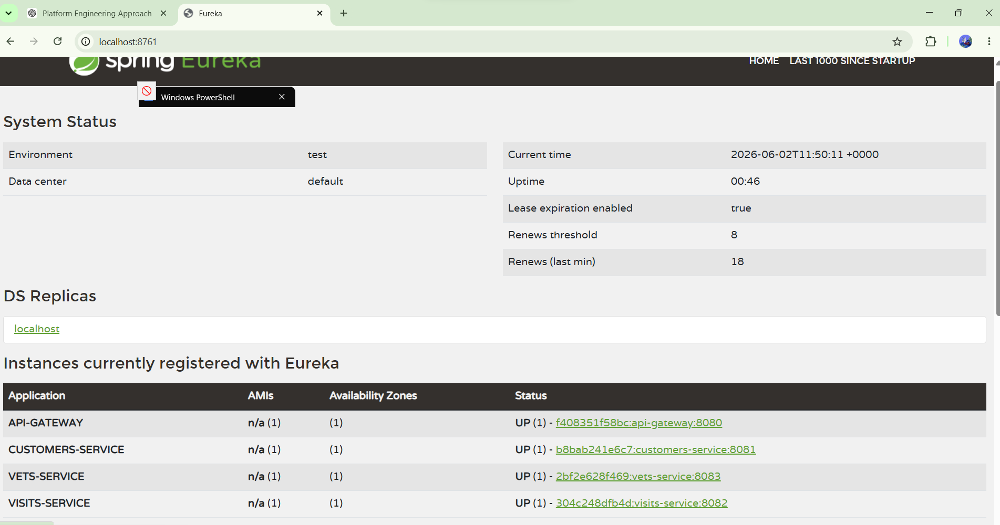
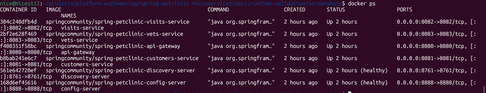
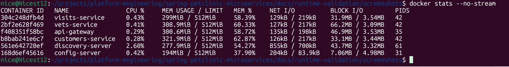
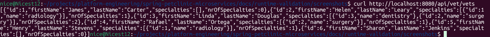

# Spring Petclinic Microservices – Local Runtime Validation

## Project Objective

Deploy and validate a distributed Spring Boot microservices platform locally using Docker Compose. The objective was to understand service discovery, centralized configuration management, API gateway routing, Docker networking, and distributed system startup behavior.

---

## Architecture Overview

### Components

| Service                   | Port | Purpose                              |
| ------------------------- | ---- | ------------------------------------ |
| Config Server             | 8888 | Centralized configuration management |
| Discovery Server (Eureka) | 8761 | Service registration and discovery   |
| API Gateway               | 8080 | Entry point for all client requests  |
| Customers Service         | 8081 | Customer and owner management        |
| Visits Service            | 8082 | Pet visit management                 |
| Vets Service              | 8083 | Veterinarian management              |

---

## Deployment Steps

### Environment Preparation

* Verified Docker Engine installation
* Verified Docker Compose installation
* Installed OpenJDK 17
* Verified Maven installation
* Cloned the Spring Petclinic Microservices repository

### Service Startup Sequence

Services were started in the following order:

1. Config Server
2. Discovery Server
3. Customers Service
4. API Gateway
5. Vets Service
6. Visits Service

This sequence ensured dependent services could successfully retrieve configuration and register with Eureka.

---

## Validation Performed

### Config Server Validation

Verified Config Server accessibility:

```bash
curl http://localhost:8888
```

Result: Config Server homepage loaded successfully.

---

### Eureka Validation

Verified Eureka dashboard accessibility:

```bash
http://localhost:8761
```

Result:

* API-GATEWAY registered
* CUSTOMERS-SERVICE registered
* VETS-SERVICE registered
* VISITS-SERVICE registered

All services displayed status UP.

---

### Service Health Validation

```bash
curl http://localhost:8081/actuator/health
curl http://localhost:8082/actuator/health
curl http://localhost:8083/actuator/health
```

Result:

```json
{"status":"UP"}
```

for all services.

---

### API Gateway Routing Validation

Tested distributed request routing:

```bash
curl http://localhost:8080/api/vet/vets
```

Response:

```http
HTTP/1.1 200 OK
```

Returned veterinarian data successfully.

Request flow:

Client → API Gateway → Eureka → Vets Service

This validated end-to-end service discovery and routing.

## Eureka Dashboard

The Eureka Service Registry successfully registered all running microservices.



---

## Running Containers

The following containers were running successfully during validation.



---

## Resource Utilization

Runtime CPU and memory utilization of the platform.



---

## Successful API Gateway Routing

Validation of request routing through the API Gateway to the Vets Service.



---

## Challenges Encountered

### Discovery Server Health Check Failure

Issue:

Docker Compose initially reported Discovery Server as unhealthy.

Cause:

The service startup time exceeded the configured Docker health check threshold.

Resolution:

Verified service logs and allowed sufficient startup time. Eureka became healthy and remained stable.

---

### API Gateway Routing Failure

Issue:

Initial requests through the gateway returned connection reset errors.

Cause:

Backend services had not fully completed Eureka registration.

Resolution:

Allowed all services to register successfully before testing routing.

---

### Resource Consumption

Observation:

Running multiple Spring Boot microservices caused increased CPU and memory utilization.

Approximate runtime memory consumption:

* Config Server: ~200 MB
* Discovery Server: ~250 MB
* API Gateway: ~300 MB
* Customers Service: ~300 MB
* Visits Service: ~300 MB
* Vets Service: ~300 MB

Total runtime footprint: ~1.7 GB

---

## Key Learnings

* Centralized configuration simplifies service management.
* Service discovery eliminates hardcoded service locations.
* Docker DNS enables service-to-service communication.
* API Gateways abstract backend topology from clients.
* Distributed systems require startup coordination.
* Health checks do not always indicate full readiness.
* Spring Boot microservices introduce JVM resource overhead.
* Distributed systems rely on retries and eventual consistency.

---

## Final Outcome

Successfully deployed and validated a distributed Spring Boot microservices platform consisting of:

* Config Server
* Discovery Server
* API Gateway
* Customers Service
* Visits Service
* Vets Service

All services were healthy, registered with Eureka, and accessible through the API Gateway.

Project Status: SUCCESSFUL

